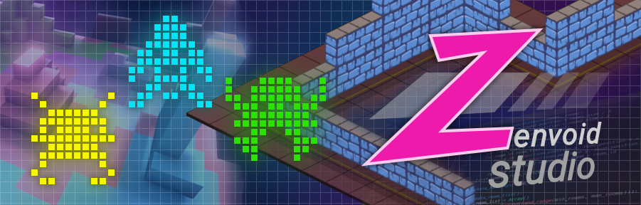

# Zenvoid Studio

Una iniciativa para desarrollo de videojuegos y aplicaciones de ocio interactivo, aprendizaje colectivo e investigación. El grupo se reúne en Madrid (España). Las reuniones presenciales son el medio principal de colaboración del grupo, pero también está abierto a la participación de personas interesadas de todo el mundo.

---

**English:** An initiative for development of videogames and interactive entertainment applications, collective learning and research. The group meets in Madrid (Spain). Face to face meetings are the group's primary means of collaboration, but it is also open to interested individuals from all around the world.

Most content will be in Spanish.
